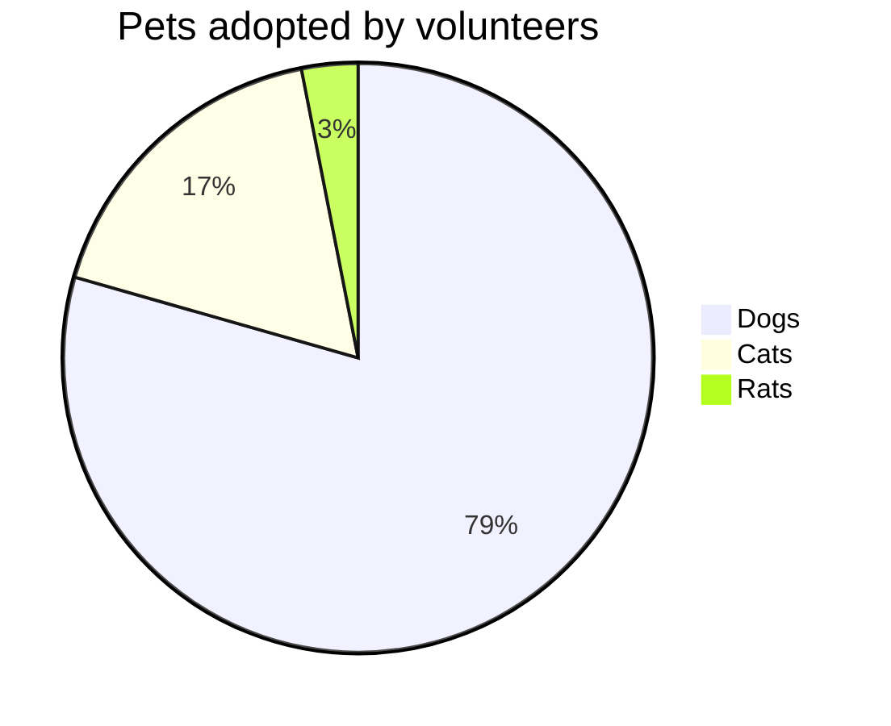
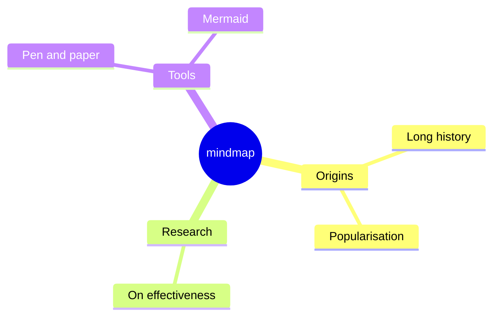
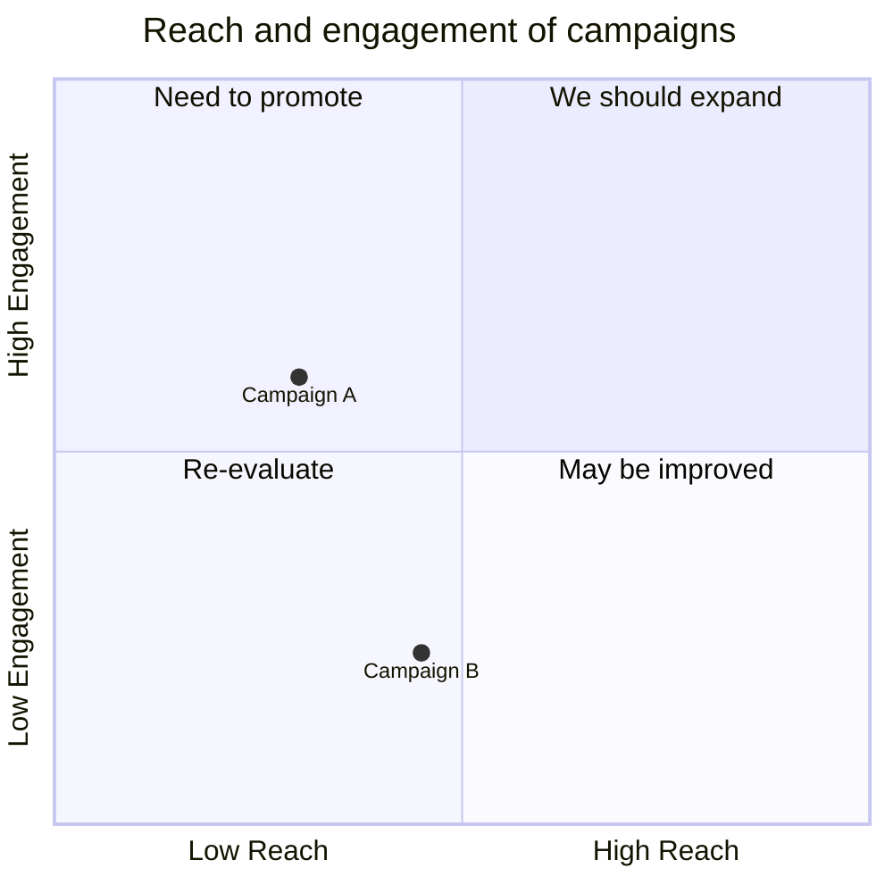
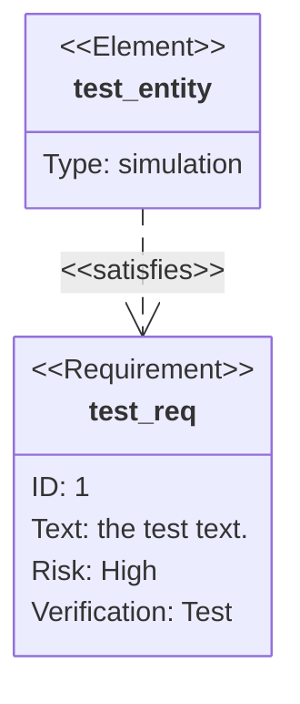
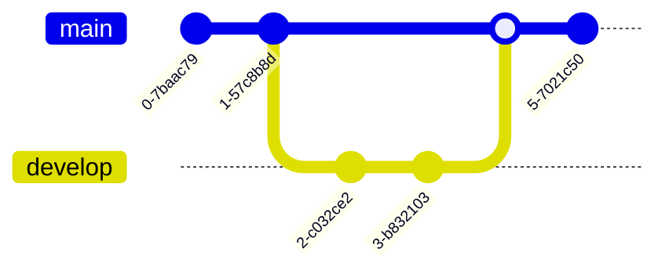

# Analytical Diagram Types

## Pie Chart
**Declaration:** `pie` (optionally `pie showData`)
**Minimal valid example:**

**Common syntax pitfalls:**
- Using zero, negative, or non-numeric values — pie values must be positive numbers greater than zero, and negatives error out.
- Dropping the quotes around a label — labels are written as `"label"` and unquoted multi-word labels will fail to parse.
- Forgetting the `:` separator between the label and its value (`"Dogs" : 386`).
- Assuming slices are ordered by value — they're actually drawn clockwise in the same order the data rows appear in the source.
- Putting `showData` on its own line instead of appending it to the `pie` declaration line (`pie showData`).

**Official reference:** https://mermaid.js.org/syntax/pie.html

## Mindmap
**Declaration:** `mindmap`
**Minimal valid example:**

**Common syntax pitfalls:**
- Relying on indentation alone to encode the hierarchy — there is no explicit parent/child syntax, so inconsistent indent widths between sibling lines produce an ambiguous outline that Mermaid must guess at.
- Mixing tabs and spaces (or varying indent size) across the same mindmap, which causes nodes to attach to the wrong parent.
- Mismatching shape delimiter pairs — `((circle))`, `(rounded)`, `[square]`, `))bang((`, `)cloud(`, and `{{hexagon}}` each need matching open/close tokens around the label.
- Putting the `::icon(...)` or `:::className` decorator on the same line as the node instead of the line immediately after it.
- Treating this as a stable, frozen syntax — Mermaid explicitly marks mindmap (especially icon integration) as experimental and subject to change.

**Official reference:** https://mermaid.js.org/syntax/mindmap.html

## Quadrant Chart
**Declaration:** `quadrantChart`
**Minimal valid example:**

**Common syntax pitfalls:**
- Plotting points outside the 0–1 range — both x and y values must fall between 0 (min) and 1 (max).
- Assuming quadrant numbers map to reading order — `quadrant-1` is top-right, `quadrant-2` is top-left, `quadrant-3` is bottom-left, and `quadrant-4` is bottom-right, not a simple left-to-right/top-to-bottom sequence.
- Using the wrong delimiter between axis labels — it must be the literal `-->` (e.g. `x-axis Low Reach --> High Reach`), and it's optional if you only want the left/bottom label rendered.
- Omitting the brackets or colon in a point definition — the required form is `<text>: [x, y]`.
- Not knowing the styling precedence — direct per-point styles (`radius:`, `color:`, etc.) override `:::class` styles, which override theme variables.

**Official reference:** https://mermaid.js.org/syntax/quadrantChart.html

## Requirement Diagram
**Declaration:** `requirementDiagram`
**Minimal valid example:**

**Common syntax pitfalls:**
- Leaving user text unquoted when it might contain a reserved keyword — the parser fails if it detects another keyword inside unquoted `id:`/`text:`/`docref:` values, so quoting (`text: "the test text."`) is the safer default.
- Using a `risk` or `verifymethod` value outside the fixed SysML enumerations (`Low`/`Medium`/`High` for risk; `Analysis`/`Inspection`/`Test`/`Demonstration` for verifymethod).
- Inventing a relationship verb — only `contains`, `copies`, `derives`, `satisfies`, `verifies`, `refines`, and `traces` are valid between the dashes/arrow.
- Getting the relationship arrow direction wrong — it's either `{source} - <type> -> {destination}` or `{destination} <- <type> - {source}`, and the dash/arrow placement must match exactly.
- Expecting the pre-v12 classic look by default — requirement diagrams now default to the `redux-color` theme, `neo` look, and ELK layout; reproducing the old appearance requires explicitly setting `theme: default`, `look: classic`, and `layout: dagre` in the front matter config.

**Official reference:** https://mermaid.js.org/syntax/requirementDiagram.html

## GitGraph Diagram
**Declaration:** `gitGraph` (optionally followed by an orientation suffix: `gitGraph LR:`, `gitGraph TB:`, or `gitGraph BT:`)
**Minimal valid example:**

**Common syntax pitfalls:**
- Assuming the default branch is called `master` — Mermaid always starts on a branch named `main` (customizable via the `mainBranchName` config), and `checkout`ing a branch name that was never created throws a console error.
- Trying to merge a branch with itself, or cherry-picking a commit that doesn't exist yet or already lives on the current branch — all three are invalid and error out.
- Cherry-picking a merge commit without a `parent:` attribute — Mermaid requires an explicit immediate-parent commit ID in that case (`cherry-pick id:"MERGE" parent:"B"`).
- Mixing up which commit attributes need quotes — `id:` and `tag:` take a quoted string (`id: "v1.0.0"`), while `type:` takes an unquoted enum keyword (`NORMAL`, `REVERSE`, or `HIGHLIGHT`).
- Placing the orientation declaration anywhere but immediately after `gitGraph`, or forgetting the trailing colon (it's `gitGraph LR:`, not `gitGraph LR` or a mid-diagram directive).

**Official reference:** https://mermaid.js.org/syntax/gitgraph.html
