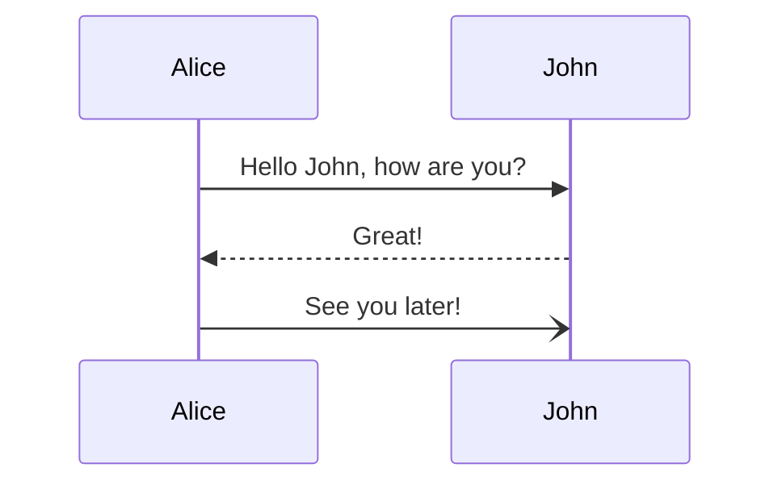
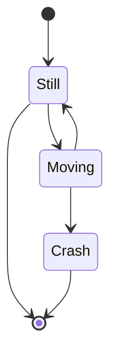
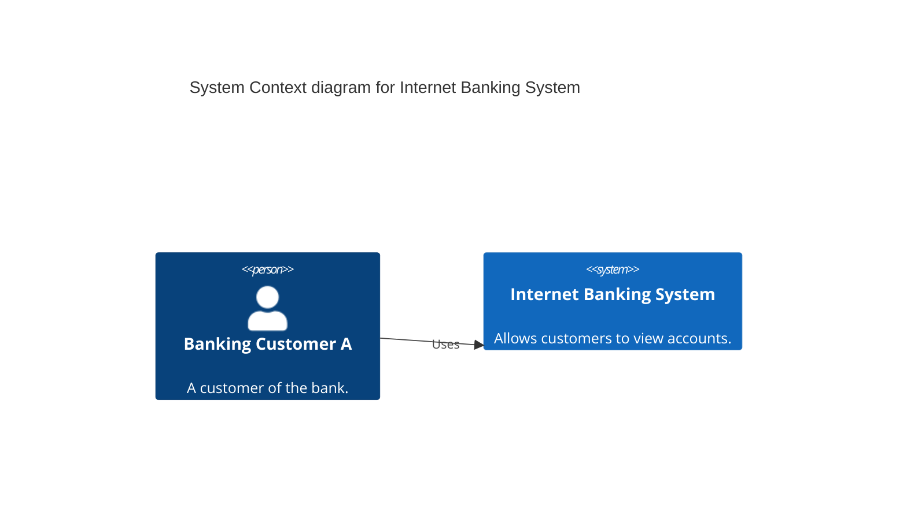
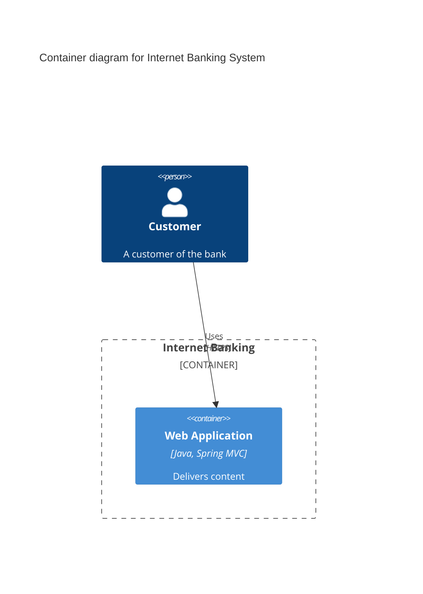
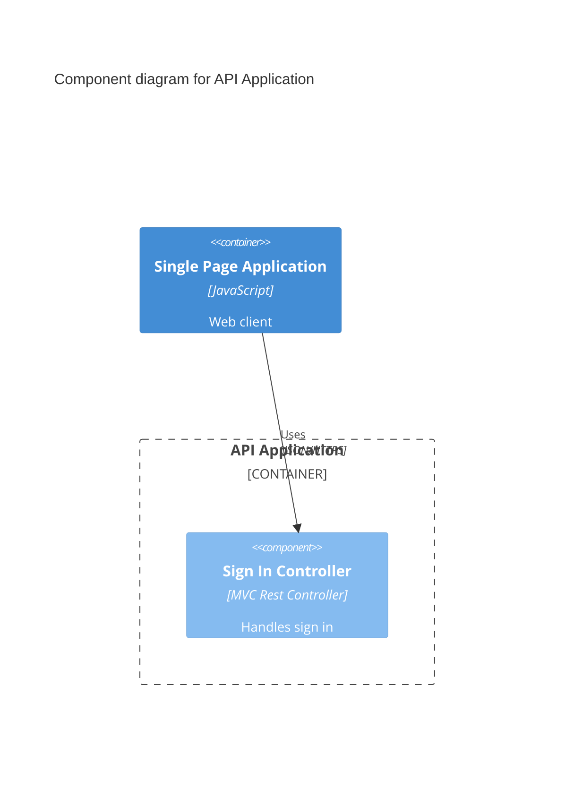
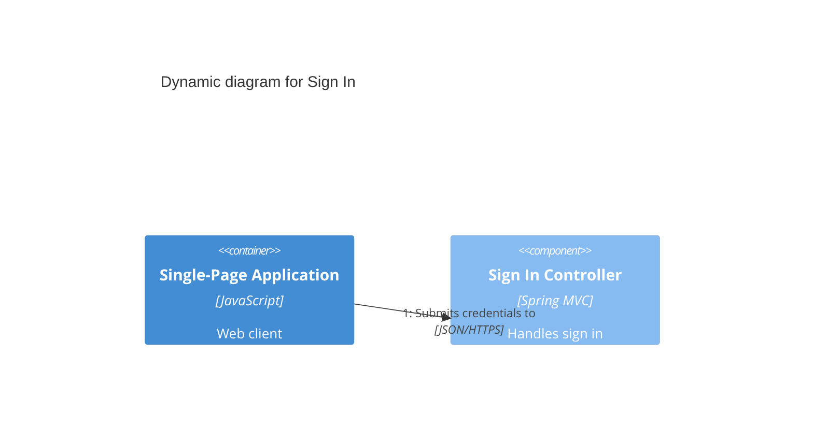
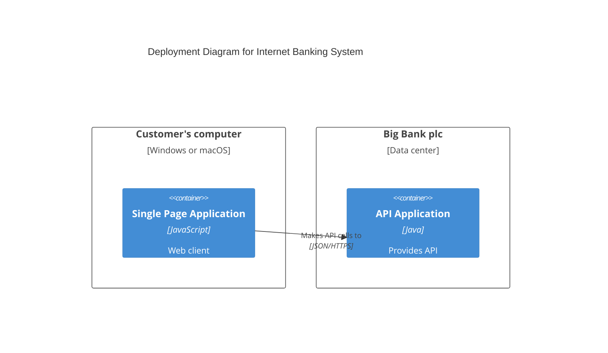

# Behavioral Diagram Types

## Sequence Diagram

**Declaration:** `sequenceDiagram`

**Minimal valid example:**

**Common syntax pitfalls:**
- Using the bare word `end` as a participant name or inside message/note text can break the parser; wrap it in parentheses, brackets, or quotes instead — `(end)`, `[end]`, `{end}`.
- Block constructs (`loop`, `alt`/`else`, `opt`, `par`/`and`, `critical`/`option`, `box`, `rect`) each require a matching `end` — a missing one silently breaks everything rendered after it.
- `box` background colors only accept `rgb()`, `rgba()`, `hsl()`, or `hsla()` — hex colors like `#ff0000` are not supported because `#` is interpreted as a comment.
- Activation must balance: every `activate X` needs a corresponding `deactivate X` (or a matching `+`/`-` pair on arrows), and stacked activations on the same actor must close in the right count or the actor is left with a dangling lifebar.
- A `destroy` directive must appear before the message that actually removes the participant/actor — destroying it without a following message referencing it raises an "associated destroying message" parser error.

**Official reference:** https://mermaid.js.org/syntax/sequenceDiagram.html

## State Diagram

**Declaration:** `stateDiagram-v2` (the legacy `stateDiagram` keyword still works but renders with the older engine)

**Minimal valid example:**

**Common syntax pitfalls:**
- `classDef`/`class` styling cannot be applied to the start/end `[*]` pseudostates, nor to or within composite states — this is a documented current limitation, not a bug.
- Transitions cannot be drawn directly between internal states that belong to two different composite states — only the composite (parent) states themselves can be connected.
- Concurrency regions inside a composite state are separated by a bare `--` line, which is easy to mistype as (or confuse with) the `-->` transition arrow.
- Choice, fork, and join pseudostates require an explicit `state <id> <<choice>>` / `<<fork>>` / `<<join>>` declaration before that id is used in a transition — you can't just start routing arrows through an undeclared name and expect the diamond shape.
- A state whose description contains spaces must be given an id first (`stateId: description text` or `state "description" as stateId`) and referenced by that id afterward; spaces cannot appear directly in a transition line.

**Official reference:** https://mermaid.js.org/syntax/stateDiagram.html

## C4 Context Diagram

**Declaration:** `C4Context`

**Minimal valid example:**

**Common syntax pitfalls:**
- The C4 syntax is still explicitly marked experimental by Mermaid — element and property names can change between releases, so pin a Mermaid version for reproducible diagrams.
- There is no automatic layout algorithm: the position of shapes follows the order statements are written in, and PlantUML's `Lay_U`/`Lay_D`/`Lay_L`/`Lay_R` layout hints are not supported — reorder statements (or use `UpdateLayoutConfig`) to change placement instead.
- `Enterprise_Boundary(...)  { ... }` and `System_Boundary(...) { ... }` need carefully matched braces; an unclosed `{` silently pulls unrelated elements into the boundary or breaks nested boundaries.
- Optional named parameters must be prefixed with `$` (e.g. `$fontColor="red"`) and follow the required positional parameters — they cannot be mixed positionally.
- Since v11.17.1 element text wraps by default; to turn that off use `c4.wrap: false` in the config front-matter (the older bare `wrap: true/false` key only affects pre-v11.17.1 behavior).

**Official reference:** https://mermaid.js.org/syntax/c4.html

## C4 Container Diagram

**Declaration:** `C4Container`

**Minimal valid example:**

**Common syntax pitfalls:**
- `Container`, `Container_Ext`, `ContainerDb`, `ContainerQueue` (and their `_Ext` variants) are distinct macros — using plain `Container` for something external or database-backed loses the shape and styling that macro is meant to convey.
- `Container_Boundary(alias, label) { ... }` needs the same brace discipline as other C4 boundaries; a missing closing brace merges the next containers into the wrong boundary.
- `UpdateRelStyle(from, to, ...)` must reference the exact same `from`/`to` alias pair (in the same order) as the corresponding `Rel` call, or the style update is silently ignored.
- `Rel_Back(from, to, label)` only reverses the arrowhead for layout purposes — it does not swap which alias is semantically the source versus the target of the label text.

**Official reference:** https://mermaid.js.org/syntax/c4.html

## C4 Component Diagram

**Declaration:** `C4Component`

**Minimal valid example:**

**Common syntax pitfalls:**
- `Component(...)` is meant to be declared inside a `Container_Boundary`; declaring it outside any boundary no longer reflects which container actually owns it.
- Diagram levels get mixed up when `Container(...)` definitions (the surrounding context, declared outside the boundary) are placed inside the `Container_Boundary` alongside `Component(...)` definitions — keep containers outside, components inside.
- As with every C4 diagram type, there's no automatic layout — the order of `Component`/`Rel` statements determines the rendered position, so adding one relationship can shift unrelated elements.

**Official reference:** https://mermaid.js.org/syntax/c4.html

## C4 Dynamic Diagram

**Declaration:** `C4Dynamic`

**Minimal valid example:**

**Common syntax pitfalls:**
- `RelIndex` accepts an explicit index parameter for compatibility with C4-PlantUML, but Mermaid ignores it — the rendered sequence number always follows the order the `Rel`/`RelIndex` statements appear in the source, not the index argument's value.
- All participating elements (`Container`, `Component`, `ContainerDb`, etc.) still need to be declared with their own macro before they appear in a `Rel` call, exactly as in the other C4 diagrams — a dynamic diagram does not implicitly create participants the way a sequence diagram does.
- Because numbering is purely statement-order-based, reordering `Rel` lines to fix the visual layout will also renumber the steps — visual layout and step order can't be tuned independently.

**Official reference:** https://mermaid.js.org/syntax/c4.html

## C4 Deployment Diagram

**Declaration:** `C4Deployment`

**Minimal valid example:**

**Common syntax pitfalls:**
- `Deployment_Node` blocks nest arbitrarily deep (device → OS → app server → container), and every opening `{` needs a matching `}` — deeply nested deployment trees are the easiest place in any C4 diagram to lose a brace.
- Node and container aliases must stay unique across the whole diagram even though they are declared inside different nested `Deployment_Node` blocks, since `Rel` references them by alias globally, not by nesting path.
- `Rel_U`/`Rel_D`/`Rel_L`/`Rel_R` only hint the layout direction for that one relationship's line routing — they don't reorder or reposition the surrounding nodes themselves.

**Official reference:** https://mermaid.js.org/syntax/c4.html
