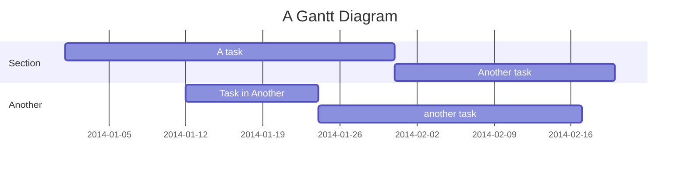
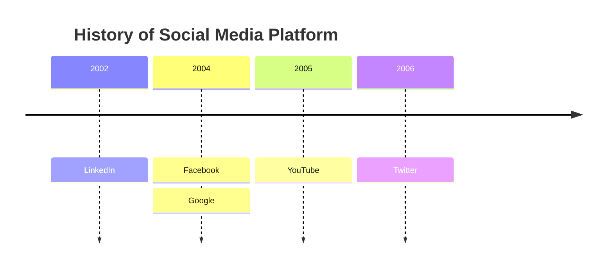
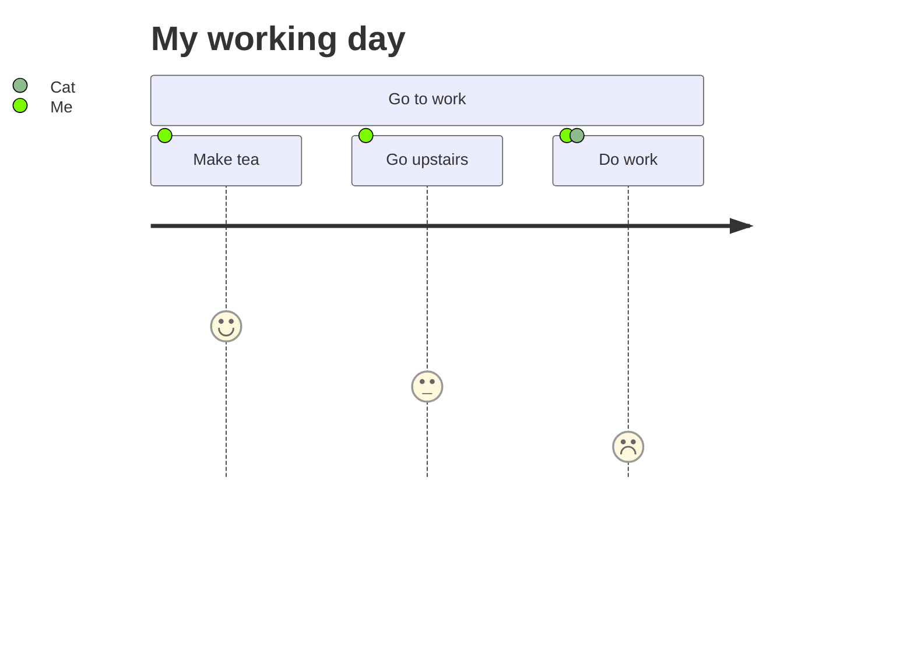

# Planning Diagram Types

## Gantt Chart
**Declaration:** `gantt`
**Minimal valid example:**

**Common syntax pitfalls:**
- The task title and its metadata must be separated by a single `:`, and metadata items after that are comma-separated (`title :tag, id, start, duration`); tags (`active`, `done`, `crit`, `milestone`) are optional but if present must come first, before the id/date/duration fields.
- Tasks are sequential by default — a task with no explicit start date begins at the end date of the preceding task, so reordering lines changes the schedule even without touching dates.
- `excludes` accepts specific `YYYY-MM-DD` dates, day names (e.g. `sunday`), or the literal word `weekends` — the word `weekdays` is *not* supported, a common mistake.
- Durations need a valid unit suffix (`ms`, `s`, `m`, `h`, `d`, `w`, `M` for months, `y`) — note `M` (months) vs `m` (minutes) is case-sensitive, and an invalid token like `3dX` is silently ignored, collapsing the task to zero duration instead of erroring.
- Referencing another task with `after <taskID>` (or `until <taskID>`) requires that task's ID to already be defined earlier via `:id,` in its own metadata; a milestone's plotted position is `initial date + duration/2`, not the raw date, which surprises people expecting it to sit exactly at the given timestamp.
**Official reference:** https://mermaid.js.org/syntax/gantt.html

## Timeline
**Declaration:** `timeline`
**Minimal valid example:**

**Common syntax pitfalls:**
- To add a second event to the *same* time period, repeat a line with just `: event` (leaving the period blank) rather than re-typing the period — retyping the period creates a new, duplicate entry on the axis instead of stacking events under the existing one.
- `section` groups time periods into ages and drives the shared color scheme for everything inside it; if no `section` is declared, each time period gets its own individual color by default (disable this with the `disableMulticolor` theme/config option if a single uniform color is wanted).
- Long text wraps automatically to avoid overflowing the diagram — use ` ` to force an explicit line break instead of relying on wrapping when a specific break point matters.
- This is explicitly marked an experimental diagram type; the icon-integration syntax in particular is called out as unstable and may change in future Mermaid releases.
- Direction is set with a keyword directly after `timeline` (e.g. `timeline TD`), only `LR` (default) and `TD` are valid, and this directive requires v11.14.0+ — older renderers will not recognize it.
**Official reference:** https://mermaid.js.org/syntax/timeline.html

## User Journey Diagram
**Declaration:** `journey`
**Minimal valid example:**

**Common syntax pitfalls:**
- Task syntax is strictly `Task name: <score>: <comma-separated actors>` — exactly two colons; omitting the actor list or adding extra colons breaks the parser.
- The score must be an integer from 1 to 5 inclusive; out-of-range or non-numeric scores are invalid.
- `section` is required to group related tasks (e.g. "Go to work") — tasks are not meant to stand outside a section.
- Actor names must match exactly (including capitalization) across tasks for Mermaid to consistently color-code and group the same actor throughout the journey; a typo'd actor name silently becomes a distinct actor.
- Multiple actors for one task are separated by commas after the score (e.g. `Do work: 1: Me, Cat`), not by repeating the task line.
**Official reference:** https://mermaid.js.org/syntax/userJourney.html
