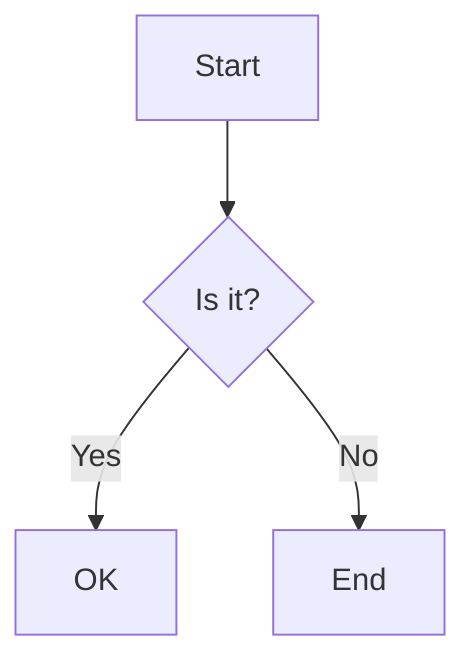
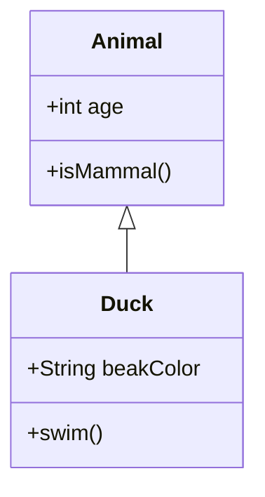
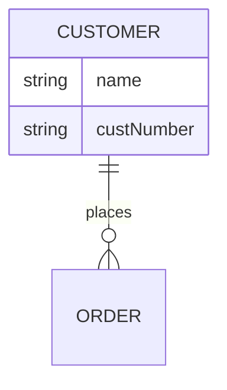

# Structural Diagram Types

## Flowchart
**Declaration:** `flowchart TD` (direction is one of `TB`, `TD`, `BT`, `RL`, `LR`; the legacy alias `graph TD` also still works)
**Minimal valid example:**

**Common syntax pitfalls:**
- Using the bare lowercase word `end` as a node id or label text breaks the parser entirely — it must be capitalized in some way (`End`, `END`) or worked around.
- A node id starting with `o` or `x` immediately before a `---` link (e.g. `dev---ops`) is parsed as a circle edge (`---o`) or cross edge (`---x`) instead of a plain line; add a space or capitalize the letter (`dev--- ops`) to avoid it.
- Special characters like parentheses inside unquoted node text (e.g. `id1[This is the (text) in the box]`) break parsing — wrap the label in double quotes instead.
- Extra dashes used to lengthen a link's rank span must go on the correct side and match the link style's character (`-`, `=`, or `.`) — e.g. `B -- Yes --> C` vs `B -->|Yes| C` require the extra dash in different positions, and the counts differ between normal (`--->`), thick (`===>`), and dotted (`-..->`) links.
- If any node inside a `subgraph` links to a node outside that subgraph, the subgraph's own `direction` statement is silently ignored and it instead inherits the parent graph's direction.

**Official reference:** https://mermaid.js.org/syntax/flowchart.html

## Class Diagram
**Declaration:** `classDiagram`
**Minimal valid example:**

**Common syntax pitfalls:**
- Mermaid decides attribute vs. method purely by the presence of parentheses `()` — a method definition missing them (e.g. `deposit(amount)` written as `deposit`) is rendered as a plain attribute instead.
- A method's optional return type needs a space before it (`+deposit(amount) bool`, not `+deposit(amount)bool`) or parsing breaks.
- Generics use tildes, not angle brackets — `List~int~`, not `List<int>` — and a generic containing a comma (e.g. `List~K, V~`) is not supported.
- Class names may only contain alphanumeric characters, underscores, and dashes; names with other characters (spaces, `!`, etc.) need either backtick escaping (`` class `Car Class` ``) or a bracketed label (`class Car["Car with *! symbols"]`).
- The eight relationship arrows (`<|--` inheritance, `*--` composition, `o--` aggregation, `-->` association, `--` solid link, `..>` dependency, `..|>` realization, `..` dashed link) are easy to mix up — in particular composition (`*--`) vs. aggregation (`o--`) — and the arrow direction determines which class is the parent/target (e.g. `classA <|-- classB` means `classB` inherits from `classA`).

**Official reference:** https://mermaid.js.org/syntax/classDiagram.html

## Entity Relationship Diagram
**Declaration:** `erDiagram`
**Minimal valid example:**

**Common syntax pitfalls:**
- Cardinality markers are two-character crow's-foot pairs (e.g. `||`, `}o`, `}|`, `o{`) where the outer character is the maximum and the inner character is the minimum — transposing them (writing `o|` instead of `|o`) silently changes the modeled cardinality rather than raising an error.
- The line style at the relationship's center encodes meaning, not decoration: `--` (solid) means an *identifying* relationship, `..` (dashed) means *non-identifying* — picking the wrong one misrepresents whether the child entity can exist independently.
- Entity or attribute names containing spaces must be double-quoted (e.g. `"Customer Account"`), and a subgraph id containing spaces must likewise be quoted whenever it's referenced in a relationship statement.
- Attribute key annotations (`PK`, `FK`, `UK`) must come after the attribute name, with multiple keys comma-separated (`PK, FK`); a trailing `"comment"` string is separate from the key and cannot itself contain double-quote characters.
- Only the first entity in a statement is mandatory (useful for showing an isolated entity); as soon as a relationship arrow is added, the second entity and the `: label` become mandatory too — a dangling arrow with no second entity/label is invalid.

**Official reference:** https://mermaid.js.org/syntax/entityRelationshipDiagram.html
